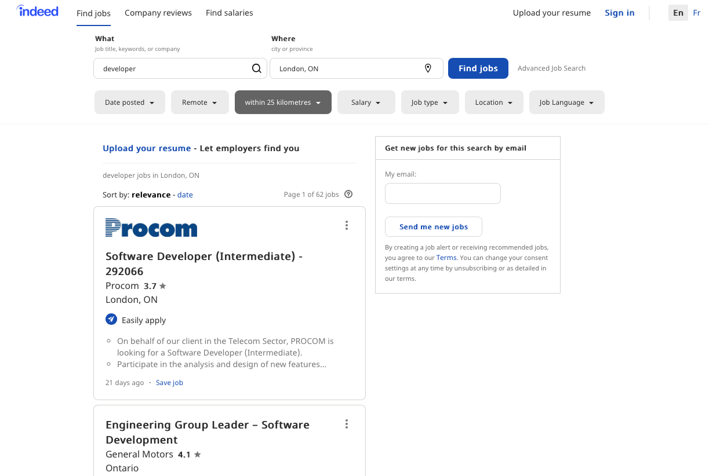
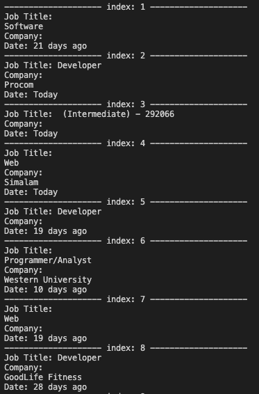
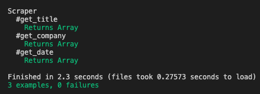

# My Scraper

> this is an educational project required by Microverse as part of the curriculum that requires the construction of a simple scraper and for this project I chose the site (https://ca.indeed.com/jobs?q=developer&l=London%2C+ON) to get three informations: The Job's name, Company's name and the date that was posted and add testes.

## Assessment criteria

- Create effective Ruby code, that solves the problem
- Apply Ruby coding best practices.
- Create unit test for Ruby code
- Implement basic OOP principles (encapsulation, inheritance) in Ruby
- Have a organized project structure: modules, files and folders
- Use common Ruby patterns
- Chooses a simple solution over a more complex answer wherever possible.
- Ability to multitask and effectively manage time and prioritization.
- Ability to translate business requirements into software solutions.
- Ability to perform tasks and complete projects with minimal supervision.

### The original Web site

### My scraper Output

## Built With

- Ruby,
- Gems used: nokogiri and open-uri,
- VSCode

## Getting Started

**Cloning a Git repository:**
 - From the repository, click + in the global sidebar and select Clone this repository under Get to work.
 - Copy the clone command (either the SSH format or the HTTPS). ...
 - From a terminal window, change to the local directory where you want to clone your repository.

**To start *My_Scraper*:**

 - You need to have ruby installed on your machine and the Gems: ``nokogiri`` and ``open-uri``.
 - run command ``git clone https://github.com/brugobi/Tic-Tac-Toe-Ruby.git`` to clone the repository
 - go into the folder containing the project by typing ``cd my_scraper``
 - type in your terminal the command `` ruby bin/main.rb ``

### Run tests

 - Unit test (Rspec)

 

To run the unit testings you will need to install the gem rspect with the following command

`gem install rspec`

To see the test results run the following command

`rspec --format documentation`

## Author

👤 **Bruna Gobi**

- Github: [@brugobi](https://github.com/brugobi)
- Twitter: [@BrunaGobi2](https://twitter.com/BrunaGobi2)
- Linkedin: [bruna-gobi](https://www.linkedin.com/in/bruna-gobi/)

## 🤝 Contributing

Contributions, issues and feature requests are welcome!

Feel free to check the [issues page](issues/).

## Show your support

Give a ⭐️ if you like this project!

## Acknowledgments

- Microverse
- Hat tip to anyone whose code was used
- Inspiration
- etc

## 📝 License

This project is [MIT](lic.url) licensed.
